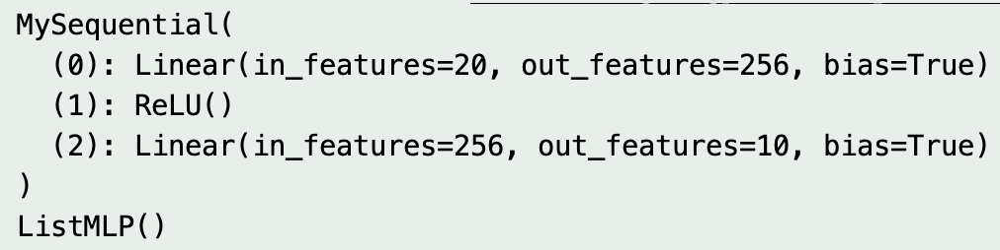

### 5.1 层和块

> 块-可以描述单个层、由多个层组成的组件或整个模型本身。

### 5.2 参数
> 讲了访问参数的一些方法，以及初始化参数的一些方法包括使用pytorch自己的方法，以及如何自定义初始化参数的方法。

### 5.3 延后初始化
> 这部分在中文版是没有代码的，在英文版才有代码。

**5.1习题**
1. 如果将MySequential中存储块的方式更改为Python列表，会出现什么样的问题？
   > 如果将MySequential中存储块的方式改为python列表，神经网络功能上仍然能正常工作。但是如下图所示，print(net)就不能打印正常的网络结构。
   
2. 实现一个块，它以两个块为参数，例如net1和net2，并返回前向传播中两个网络的串联输出。这也被称为平行块。
    ```python
    class n3(nn.Module):
        def __init__(self,b1,b2):
            super(n3,self).__init__()
            self.b1 = b1
            self.b2 = b2
        
        def forward(self,X):
            X = torch.cat((self.b1(X),self.b2(X)))
            return X

    b = n3(nn.Linear(20,5),nn.Linear(20,10))
    net = nn.Sequential(b,nn.ReLU(),nn.Linear(15,5))
    X = torch.rand(20)
    print(net(X).shape)
    ```
3. 假设我们想要连接同一网络的多个实例。实现一个函数，该函数生成同一个块的多个实例，并在此基础上构建更大的网络。
   ```python
   class largeBlock(nn.Module):
    def __init__(self,size):
        super().__init__()
        self.models = []
        self.final_layer = nn.Sequential(
            nn.Linear(size*64,256),
            nn.ReLU(),
            nn.Linear(256,10)
        )
        for i in range(size):
            self.models.append(nn.Linear(20,64))
    
    def forward(self,X):
        lst = [model(X) for model in self.models]
        print(lst[0].type)
        X = torch.cat(lst)
        return self.final_layer(X)
    
    X = torch.rand(20)
    net = largeBlock(4)
    print(net(X))
   ```