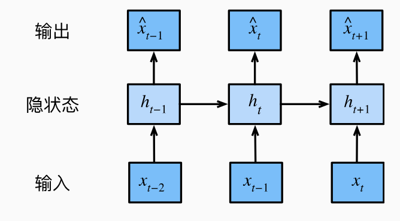
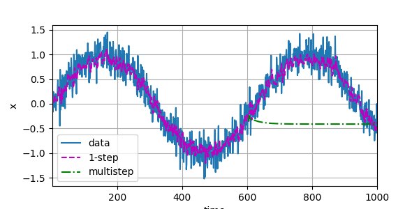

### 8.1 序列模型

**自回归模型**
对于问题：如何根据以前的数据预测未来的数据，抽象为
$$
P(x_t|x_{t-1},x_{t-2},...,x_{0})
$$
有两种解决方案，
一种是自回归模型（autogressive models），即只观察一定范围内的数据。
$$
P(x_t | x_{t-1},x_{t-2},...x_{t-n})
$$
另一种是隐变量自回归模型（latent autoregressive models）。 即保持某个隐状态$h_{t-1}$，使用如下公式更新隐状态。
$$
h_t = g(h_{t-1},x_{t-1})
$$
并根据$x_{t-1}$以及$h_t$产生新的状态。

那么问题来了，我们应该怎样训练模型呢。假设序列是静止的，也就是按照某一动力发展的，那么我们可以用这个静态的趋势去生成我们的训练数据
$$
P(x_1,x_2,...x_T) = \prod^T_{t=1} P(x_t | x_{t-1},...,x_1)
$$

**马尔可夫模型（Markov condition)**

利用上面的公式可以理解一阶马尔可夫模型，即只回头看1个。回头看n个成为n阶马尔可夫模型。
$$
P(x_1,x_2,...x_T) = \prod^T_{t=1} P(x_t | x_{t-1})
$$
利用一阶马尔可夫链可以写出如下公式，(1)利用了全概率公式和条件概率公式；(2)利用了马尔可夫分布的条件独立性，即只与前面的1个有关，而不与前两个有关。(3)再次使用了条件概率公式最终得到了(4)。
$$P(x_{t+1} | x_{t-1}) = \frac {\sum_{x_t} P(x_{t+1},x_t,x_{t-1}) } {P(x_{t-1})} \tag{1}$$
$$P(x_{t+1} | x_{t-1}) = \frac {\sum_{x_t} P(x_{t+1}|x_t,x_{t-1}) P(x_t,x_{t-1})} {P(x_{t-1})} \tag{2}$$
$$P(x_{t+1} | x_{t-1}) = \frac {\sum_{x_t} P(x_{t+1}|x_t) P(x_t|x_{t-1})P(x_{t-1})} {P(x_{t-1})} \tag{3}$$
$$P(x_{t+1} | x_{t-1}) =  {\sum_{x_t} P(x_{t+1}|x_t) P(x_t|x_{t-1})} \tag{4}$$

通过这个图可以看到基于onestep-prediction与multistep-prediction的差异。

### 8.2 文本预处理

主要讲了如何对文本的字符串分割的方法，主要学习了python中的__getitem__以及@property的用法。

**8.1 习题**
8.1的习题翻译就是一坨屎...建议看英文版看看真正的意思。
1. 改进本节实验中的模型。
   1. 更好的模型是否包含了过去4个以上的观测结果？真实值需要是多少个？
   调整到5，32等等嵌套数量，都没有获得更低的loss值。
   2. 如果没有噪音，需要多少个过去的观测结果？提示：把sin和cos写成另外的等式。
   这题不太理解题目的意思。是把x = sin(0.01*time) 写成比如cos(0.01 * time)还是什么别的呢。
   3. 可以在保持特征总数不变的情况下合并旧的观察结果吗？这能提高正确度吗？为什么？
   4. 改变神经网络架构并评估其性能。
2. 一位投资者想要找到一种好的证券来购买。他查看过去的回报，以决定哪一种可能是表现良好的。这一策略可能会出什么问题呢？

3. 时间是向前推进的因果模型在多大程度上适用于文本呢？
   我认为在一定程度上因果模型是适用于文本的。但可能会忽略一些文本上的其他可能性。
4. 举例说明什么时候可能需要隐变量自回归模型来捕捉数据的动力学模型。
   预测股价可以通过这个实现。

**8.2 习题**
1. 词元化是一个关键的预处理步骤，它因语言而异。尝试找到另外三种常用的词元化文本的方法。
   * BPE（Byte Pair Encoding)， BPE是子词切分方法，用于将文本切分成子词。对文本中最频繁出现的字符对（byte pair）合并成一个子词，直到达到预设的词汇大小。
   * WordPiece，但更多的应用于Transformer模型。
   * SentencePiece，基于BPE。
2. 在本节的实验中，将文本词元为单词和更改Vocab实例的min_freq参数。这对词表大小有何影响？