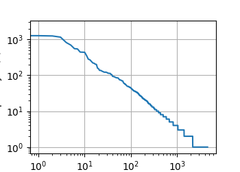

### 8.1 序列模型

**自回归模型**
对于问题：如何根据以前的数据预测未来的数据，抽象为

$$
P(x_t|x_{t-1},x_{t-2},...,x_{0})
$$

有两种解决方案，
一种是自回归模型（autogressive models），即只观察一定范围内的数据。

$$
P(x_t | x_{t-1},x_{t-2},...x_{t-n})
$$

另一种是隐变量自回归模型（latent autoregressive models）。 即保持某个隐状态$h_{t-1}$，使用如下公式更新隐状态。

$$
h_t = g(h_{t-1},x_{t-1})
$$

并根据$x_{t-1}$以及$h_t$产生新的状态。

那么问题来了，我们应该怎样训练模型呢。假设序列是静止的，也就是按照某一动力发展的，那么我们可以用这个静态的趋势去生成我们的训练数据
$$
P(x_1,x_2,...x_T) = \prod^T_{t=1} P(x_t | x_{t-1},...,x_1)
$$

**马尔可夫模型（Markov condition)**

利用上面的公式可以理解一阶马尔可夫模型，即只回头看1个。回头看n个成为n阶马尔可夫模型。
$$
P(x_1,x_2,...x_T) = \prod^T_{t=1} P(x_t | x_{t-1})
$$
利用一阶马尔可夫链可以写出如下公式，(1)利用了全概率公式和条件概率公式；(2)利用了马尔可夫分布的条件独立性，即只与前面的1个有关，而不与前两个有关。(3)再次使用了条件概率公式最终得到了(4)。
$$P(x_{t+1} | x_{t-1}) = \frac {\sum_{x_t} P(x_{t+1},x_t,x_{t-1}) } {P(x_{t-1})} \tag{1}$$
$$P(x_{t+1} | x_{t-1}) = \frac {\sum_{x_t} P(x_{t+1}|x_t,x_{t-1}) P(x_t,x_{t-1})} {P(x_{t-1})} \tag{2}$$
$$P(x_{t+1} | x_{t-1}) = \frac {\sum_{x_t} P(x_{t+1}|x_t) P(x_t|x_{t-1})P(x_{t-1})} {P(x_{t-1})} \tag{3}$$
$$P(x_{t+1} | x_{t-1}) =  {\sum_{x_t} P(x_{t+1}|x_t) P(x_t|x_{t-1})} \tag{4}$$

通过这个图可以看到基于onestep-prediction与multistep-prediction的差异。

### 8.2 文本预处理

主要讲了如何对文本的字符串分割的方法，主要学习了python中的__getitem__以及@property的用法。

### 8.3 语言模型和数据集

$$
P(x_1,x_2,...x_T) = \prod^T_{t=1} P(x_t | x_{t-1})
$$

在训练时，可以统计ab词汇出现次数除以a的出现次数，得到P(b|a)。但是在使用样本训练时，a b c三个词的组合可能很少，基本没有出现。但在实际中是有可能出现的，引入了Laplace平滑,在计数问题中中添加一个小的常量。但是计数带来的问题是，并没有关注词汇本身的语义。

$$
\hat{P}(x) = \frac{n(x)+\epsilon_1 / m}{n + \epsilon_1}
$$
$$
\hat{P}(x'|x) = \frac{n(x,x')+\epsilon_2 \hat{P}(x')}{n + \epsilon_2}
$$

8.3 从8.2的代码引入，讲述了齐普夫定律(Zipf's law),n_i是 第i个词汇出现的次数，\alpha 是刻画分布的指数。进一步，如果想通过计数和尾部添加常数（也就是上述提到的解决方案）来解决尾部词语训练的问题，那么会大大提高尾部单词的概率（但实际不应该有这么高）。
$$
n_i \propto \frac{1}{i^{\alpha}}
$$

接着作者 对二元组和三元组的分布次数进行了建模，说明许多单词序列符合 Zipf's law，但由于语言中的结构多样性，许多n元组并未出现，引入了深度学习的模型替代Zipf's law。 那么如何进行深度学习呢？两个问题，**随机采样**， **顺序分区**。

其实这节很怪，非常赞同评论里的同学的说法，先说laplace smoothing可以解决部分低频率词语出现问题，接着又说词的频率符合Zipf's law，而Zipf's law说明害得靠深度学习模型来解决？其实有点不太懂。

### 8.4 循环神经网络
循环神经网络（recursive neural networks）。
困惑度（perplexity）, 可以简单理解成，下一个词元的实际选择数的调和平均数。
当完美预测时，p=1；当根本不对时，p为无穷，也就是永远无穷。
$$
exp(-\frac{1}{n}\sum^n_{t=1}P(x_t|x_{t-1},...,x_1))
$$
[关于perplexity的理解](http://sentiment-mining.blogspot.com/2016/11/perplexity.html) 感觉比d2l讲得好很多。

**8.1 习题**
8.1的习题翻译就是一坨屎...建议看英文版看看真正的意思。
1. 改进本节实验中的模型。
   1. 更好的模型是否包含了过去4个以上的观测结果？真实值需要是多少个？
   调整到5，32等等嵌套数量，都没有获得更低的loss值。
   2. 如果没有噪音，需要多少个过去的观测结果？提示：把sin和cos写成另外的等式。
   这题不太理解题目的意思。是把x = sin(0.01*time) 写成比如cos(0.01 * time)还是什么别的呢。
   3. 可以在保持特征总数不变的情况下合并旧的观察结果吗？这能提高正确度吗？为什么？
   4. 改变神经网络架构并评估其性能。
2. 一位投资者想要找到一种好的证券来购买。他查看过去的回报，以决定哪一种可能是表现良好的。这一策略可能会出什么问题呢？

3. 时间是向前推进的因果模型在多大程度上适用于文本呢？
   我认为在一定程度上因果模型是适用于文本的。但可能会忽略一些文本上的其他可能性。
4. 举例说明什么时候可能需要隐变量自回归模型来捕捉数据的动力学模型。
   隐变量自回归模型主要适用于复杂的时间序列关系，缺少可观测数据以及数据降维的情况。预测股价可以通过这个实现。

**8.2 习题**
1. 词元化是一个关键的预处理步骤，它因语言而异。尝试找到另外三种常用的词元化文本的方法。
   * BPE（Byte Pair Encoding)， BPE是子词切分方法，用于将文本切分成子词。对文本中最频繁出现的字符对（byte pair）合并成一个子词，直到达到预设的词汇大小。
   * WordPiece，但更多的应用于Transformer模型。
   * SentencePiece，基于BPE。
2. 在本节的实验中，将文本词元为单词和更改Vocab实例的min_freq参数。这对词表大小有何影响？

**8.3习题**
1. 假设训练数据集中有10000个单词。一个四元语法需要存储多少个词频和相邻多词频率？
需要存储词频数量为
$$
f = C^4_{1000}
$$
相邻多词频率为 10000 * 9999 * 9998 * 9997

2. 我们如何对一系列对话建模？
   * Seq2Seq
   * RNN
   * Transformer
   * Pre-trained Language Models. e.g. BERT, GPT
3. 一元语法、二元语法和三元语法的齐普夫定律的指数是不一样的，能设法估计么？
   * 1元语法，1.0-1.2。一元语法的单词频率和排名有较为明显的反比关系。
   * 2元语法，1.5-1.8。二元语法的单词频率和排名有较为明显的反比关系。
   * 3元语法，1.8-2.0。三元语法的单词频率和排名反比关系没有前两者明显。
4. 想一想读取长序列数据的其他方法？
   * Segment Sampling. 将长序列分为不同长度的子序列，然后根据一定策略选择要读取的子序列的方法。
   * Beam Search. 束搜索，每个时间步选择多个备选序列，并根据预测分数进行排序和选择。
   * Adaptive Sampling. 自适应采样是一种根据序列的重要性或难易程度来自动调整采样策略的方法。
5. 考虑一下我们用于读取长序列的随机偏移量。
   1. 为什么随机偏移量是个好主意？
   * 避免过拟合
   * 增加样本多样性
   * 增加数据量
   2. 它真的会在文档的序列上实现完美的均匀分布吗？
   3. 要怎么做才能使分布更均匀？

6. 如果我们希望一个序列样本是一个完整的句子，那么这在小批量抽样中会带来怎样的问题？如何解决？
   问题：
   * 如果在小批量抽样时随机截取样本，可能会导致句子被截断成两个部分，这会影响模型对完整句子的学习和理解
   * 句子的长度可能会有很大的差异，这会导致在小批量抽样时，样本的长度不一致。不一致的样本长度会导致模型在处理小批量数据时需要进行填充或截断操作，增加了计算的复杂性。
   解决方案：
   * 按句子长度排序：在小批量抽样之前，可以先根据句子的长度对样本进行排序，然后再将排序后的样本划分为不同的批次。
   * 如果句子长度较长，可以采用滑动窗口的方式进行抽样。即从一个完整句子中切分出固定长度的子序列，并以子序列为单位进行小批量抽样。这样可以保证每个批次都是完整的子序列。
   * 在文本中插入一个特殊的句子边界标志，用来表示句子的结束位置。这样在小批量抽样时，可以保证一个批次中的样本不会跨越句子边界。