### 4.1 多层感知机
MLP(Multi-Layer Perception)多层感知机

比如说2个仿射变换，实际上可以归纳到1个仿射变换。那么就没有必要设置多层感知机了。
因而引入了激活函数 $\sigma$ 。有各种各样的激活函数，包括ReLU、sigmoid等等。

### 4.2 多层感知机的从零开始实现

利用torch的api进行了简单的多层感知机实现，并且进行了层数以及超参的调整。

<center>

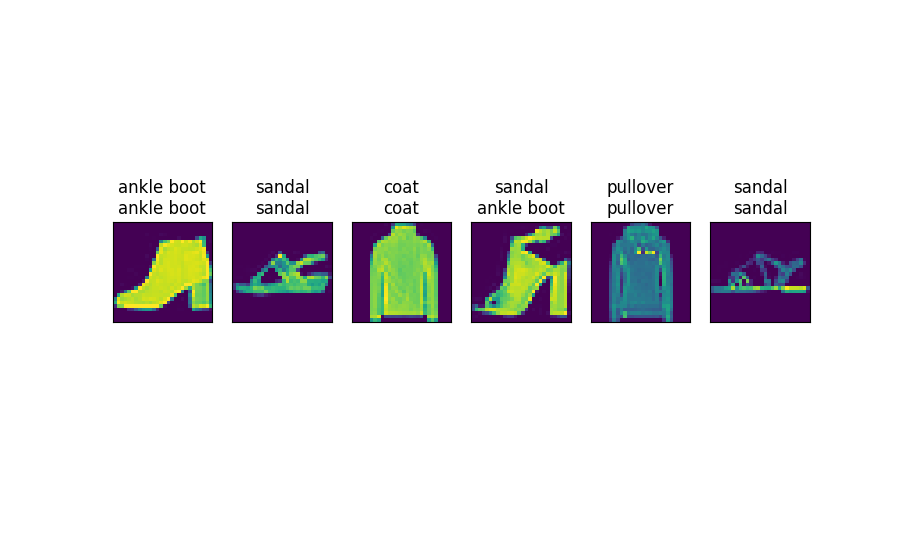

</center>

### 4.3 多层感知机的简洁实现
调用了torch的简洁接口实现了一个只有2层的多层感知机。
如在4.2中使用的是如下代码进行参数设置
```python
W1 = nn.Parameters(torch.randn(num_inputs,num_hiddens,requires_grad=True)*0.01)
```
而在4.3节中，可以直接使用torch.nn实现整个网络的构建
```python
torch.nn.Sequential(
    nn.Flatten()
    nn.Linear()
    nn.ReLU()
    nn.Linear()
)
```

### 4.4 模型选择、欠拟合和过拟合

<center> Fig 4.4.1 2阶多项式欠拟合 </center>

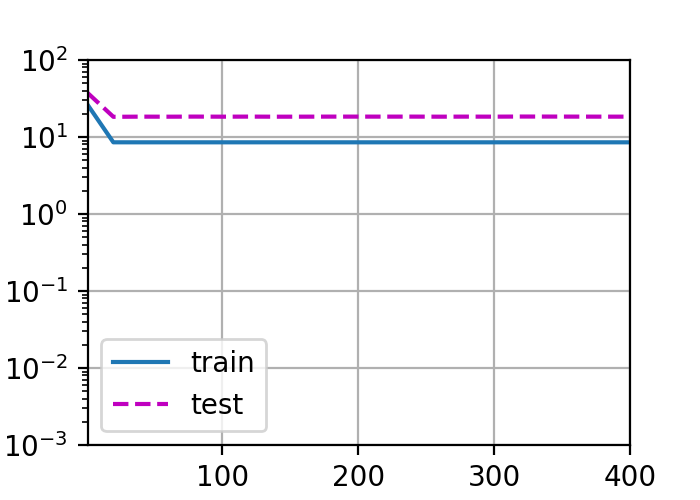

<center> Fig 4.4.2 3阶多项式拟合效果较好 </center>

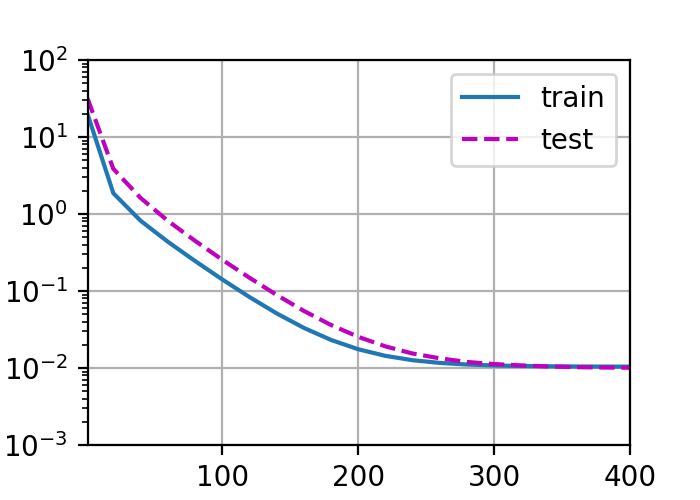

<center> Fig 4.4.3 4阶多项式存在过拟合问题 </center>

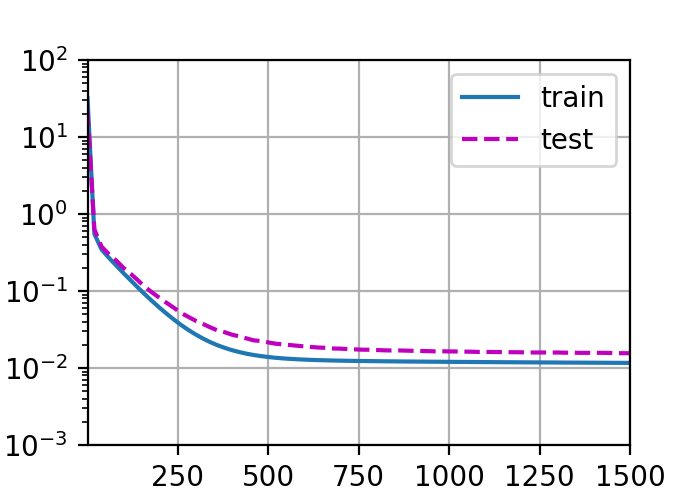

### 4.6 Dropout
> 常见的技巧是在靠近输入层的地方设置较低的暂退概率。

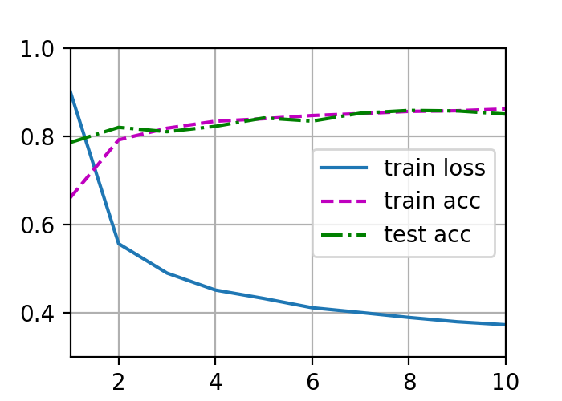

**4.1 习题**
1. 计算pReLU激活函数的导数。
> $$pReLU = max(0,x) + a * min(0,x)$$
> $$x>0,\frac{dy}{dx} = 1$$
> $$x<0,\frac{dy}{dx} = a$$
1. 证明一个仅使用ReLU（或pReLU）的多层感知机构造了一个连续的分段线性函数。
> 考虑ReLU函数 $y = max(0,x)$
> $$ \lim_{x \to 0^-} = 0$$
> $$ \lim_{x \to 0^+} = 0$$
> $$ \therefore ReLU 是连续的 $$
1. 证明$tanh(x) + 1 = 2sigmoid(2x)$。
> $$ tanh(x) = \frac{1-exp(-2x)}{1+exp(-2x)} $$
> $$ sigmoid(x) = \frac{1}{1+exp(-x)} $$
> $$ tanh(x) + 1 = \frac{2}{1+exp(-2x)} == 2 \frac{1}{1+exp(-2x)} = 2sigmoid(2x)$$
1. 假设我们有一个非线性单元，将它一次应用于一个小批量的数据。这会导致什么样的问题？
> 非线性单元通常用于捕捉数据间的复杂线形关系，但如果数据量不足，模型可能无法学习到这些复杂的关系。

**4.2 习题**
1. 在所有其他参数保持不变的情况下，更改超参数num_hiddens的值，并查看此超参数的变化对结果有何影响。确定此超参数的最佳值。
> 从10-20-50超参效果好像更好了一些，但是500的效果似乎不太好。
> <center>
> num_hiddens = 10
> </center>

> 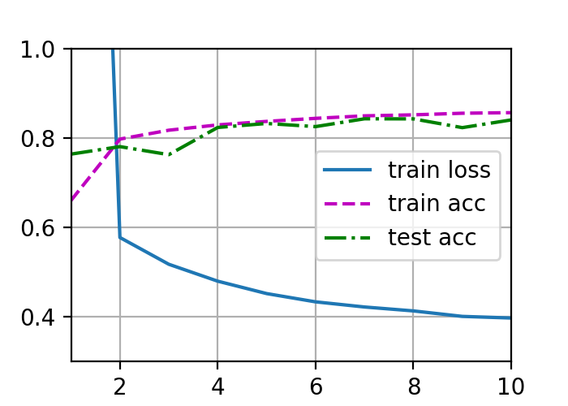

> <center>
> num_hiddens = 20
> </center>

> 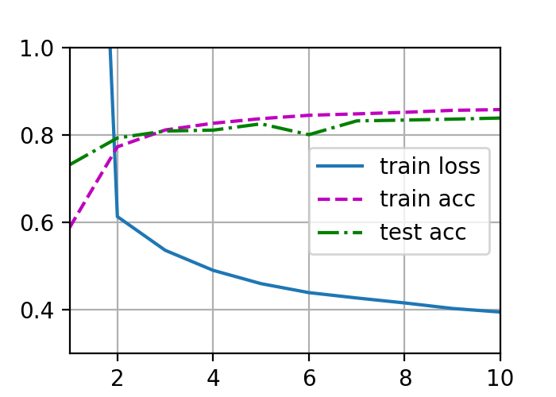

> <center>
> num_hiddens = 50
> </center>

> 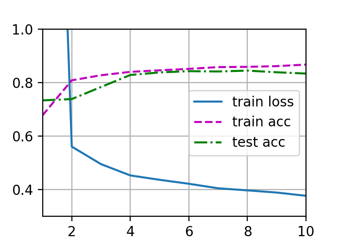

> <center>
> num_hiddens = 512
> </center>

> 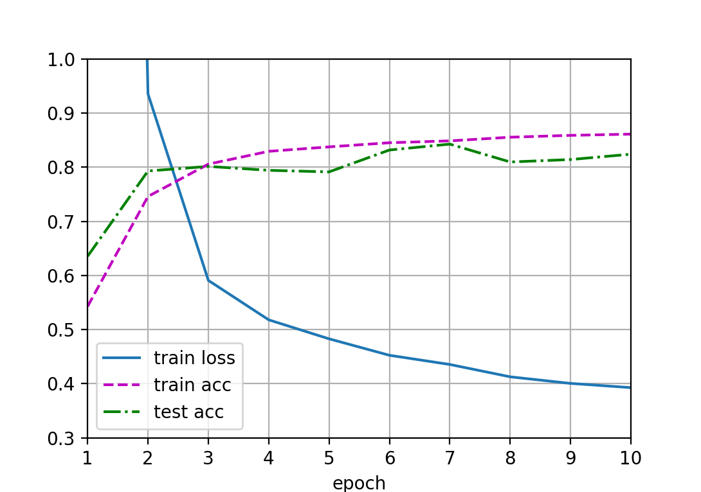

1. 尝试添加更多的隐藏层，并查看它对结果有何影响。

> 添加一层具备50个感知神经元的隐藏层，似乎结果更差了
> 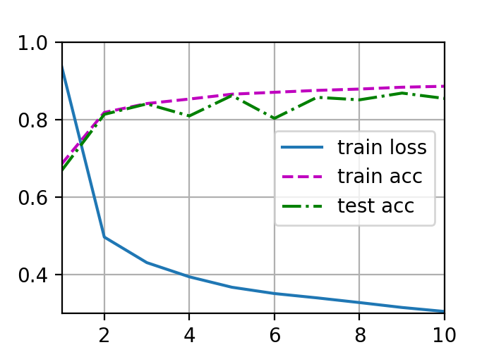

3. 改变学习速率会如何影响结果？保持模型架构和其他超参数（包括轮数）不变，学习率设置为多少会带来最好的结果？

> <center>
> epochs = 10, lr = 0.05
> </center>

> 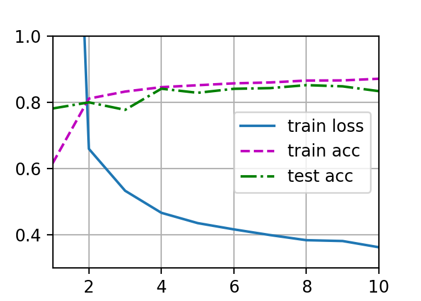

> <center>
> epochs = 10, lr = 0.05
> </center>

> 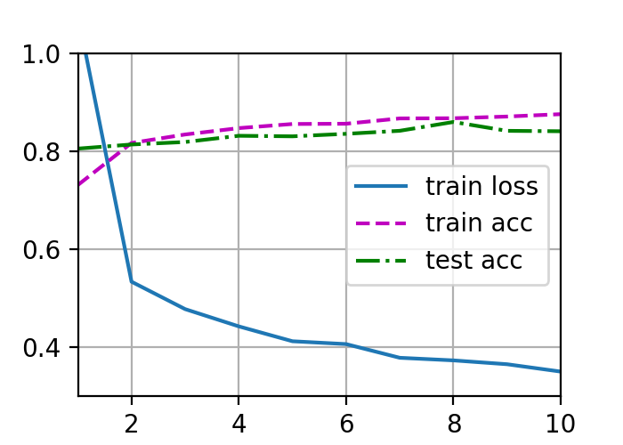

> <center>
> epochs = 10, lr = 0.05
> </center>

> 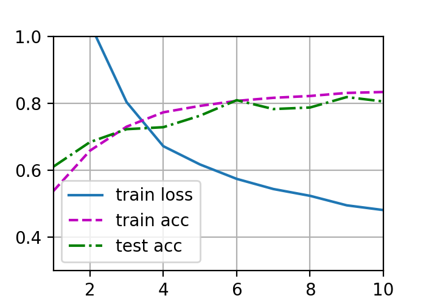


4. 通过对所有超参数（学习率、轮数、隐藏层数、每层的隐藏单元数）进行联合优化，可以得到的最佳结果是什么？
> 没打印出来最好的结果，不过我总结一下经验就是当epochs较少时，配合较低的lr可以使得整体预测效果更加稳定，质量好，如果过大的lr会导致效果不好。第二个就是当隐藏层增加时，会出现波动增加的情况，需要增加epochs和lr来提高训练效率和质量。

5. 描述为什么涉及多个超参数更具挑战性。

5. 如果想要构建多个超参数的搜索方法，请想出一个聪明的策略。

**4.3 习题**

4.3 习题主要是一些调节参数和神经网络结构的过程。由于赶进度原因没有及时做一些联系和调整。

**4.4 习题**
1. 回归问题的线形解析解
   $$ l = {\| X\omega - y \| }^ 2 $$ 
   $$ l = (X\omega - y)^T(X\omega - y)$$
   $$ l = ({\omega}^TX^T - y^T)(X\omega - y) $$
   $$ l = {\omega}^TX^TX{\omega} - {\omega}^TX^T y - y^TX\omega  + y^T y $$
   $$ \frac{\partial l}{\partial \omega} = 2X^T(X\omega-y) $$
   $$  \frac{\partial l}{\partial \omega} = 0$$
   $$ \therefore \omega = (X^TX^{-1})X^Ty $$
2. 考虑多项式的模型选择
   1. 绘制训练损失与模型复杂度（多项式的阶数）的关系图，观察到了什么？需要多少阶的多项式才能将训练损失减少到0.
   > [代码](../zh/4-4-exp.py)，将每一种可能的阶数的最终训练结果损失存储在列表中。
   > 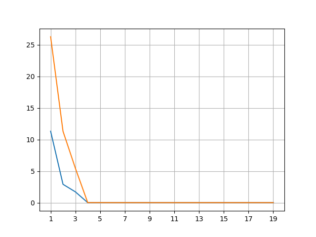
   > 可以发现训练时3阶的损失值仍然最小，而验证时11阶的损失值最小。
   2. 在这种情况下绘制测试的损失图
   3. 生成同样的图，作为数据量的函数
3. 如果不对多项式特征进行标准化$(1/i!)$，会发生什么事情？能用其他方法解决吗。
   会出现指数上溢出，导致loss值为nan。
4. 泛化误差可能为0吗？
   泛化误差指的是测试误差，不可能存在测试误差为0。因为不能确保每次数据生成的数据都是一样的，根本问题是测试集肯定会和训练集不同的问题。

**4.6习题**
1. 如果更改第一层和第二层的暂退法概率，会发生什么情况？具体地说，如果交换这两个层，会发生什么情况？设计一个实验来回答这些问题，定量描述该结果，并总结定性的结论。
> 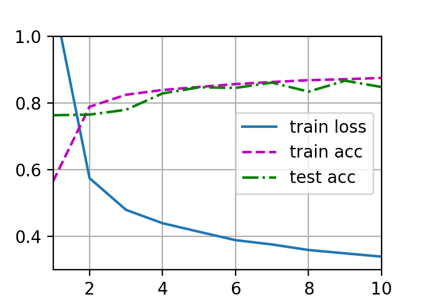
> 当更换dropout概率后，验证的准确率波动比较大。

2. 增加训练轮数，并将使用暂退法和不使用暂退法时获得的结果进行比较。
> 不使用暂退法的结果更好，但泛化性不如使用暂退法的模型

3. 当应用或不应用暂退法时，每个隐藏层中激活值的方差是多少？绘制一个曲线图，以显示这两个模型的每个隐藏层中激活值的方差是如何随时间变化的。
> [](../zh/4-6-exp3.py)

4. 为什么在测试时通常不使用暂退法？
> 训练时使用可以提高泛化能力，而在验证时我们并不期望对模型进行更新。从而基于真实环境对模型进行考量。

5. 以本节中的模型为例，比较使用暂退法和权重衰减的效果。如果同时使用暂退法和权重衰减，会发生什么情况？结果是累加的吗？收益是否减少（或者说更糟）？它们互相抵消了吗？
> 不使用暂退法法的结果如exp1中所示，
> 使用暂退法的结果如下图所示，似乎val acc波动更大且loss值远高于未使用weight decay的loss。因而在综合使用这两者时应当考虑到两者之间的互作。
> <center> weight decay = 0.02 </center>

> 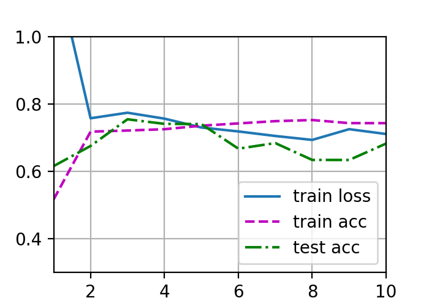

> <center> weight decay = 0.01 </center>

> 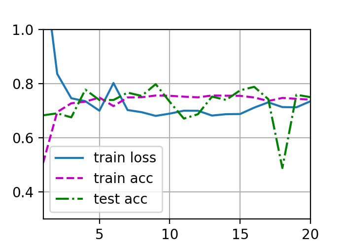

> <center> weight decay = 0.005 </center>

> 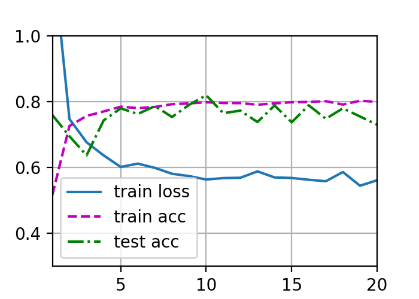

6. 如果我们将暂退法应用到权重矩阵的各个权重，而不是激活值，会发生什么？
> 我觉得fox的回答非常好，也就是说暂退法应该放在激活函数之前还是之后。暂退法应该放在激活函数之后的原因是。激活函数激活后，可能部分神经元就会有梯度了，这就导致dropout失去作用了。

7. 发明另一种用于在每一层注入随机噪声的技术，该技术不同于标准的暂退法技术。尝试开发一种在Fashion-MNIST数据集（对于固定架构）上性能优于暂退法的方法。