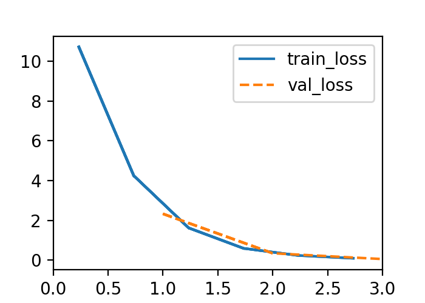
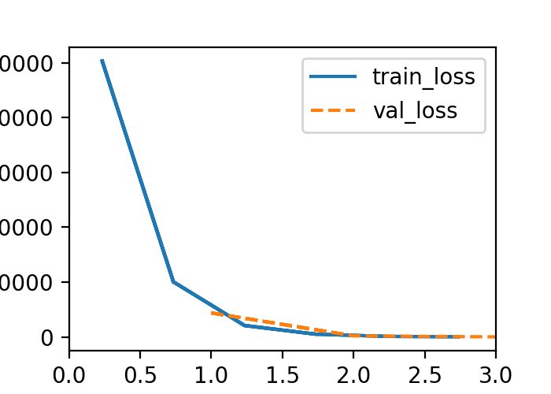
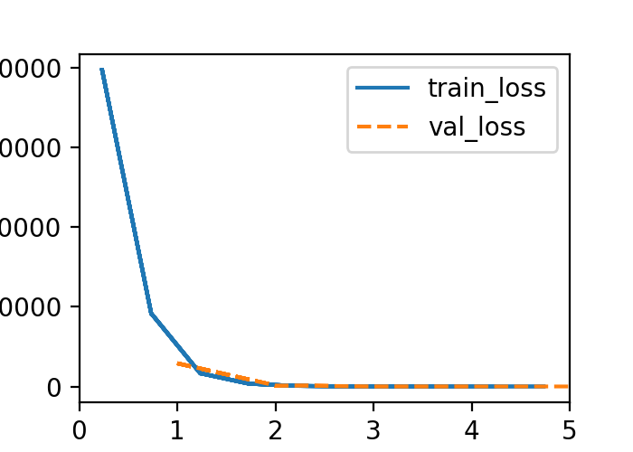
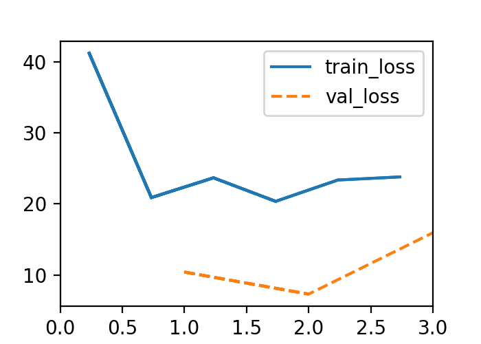
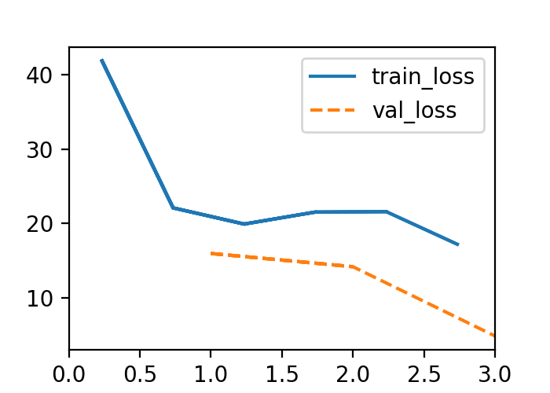

d2l-线性神经网络en.md

### 3.1 线性回归

**仿射变换（affine transformation）**：通过加权和对特征进行特征变化进行线性变换，并通过偏置项来进行平移（translation）。

对于模型而言，需要两个东西，

**（1）一种模型质量的度量方式； （2）一种能够更新模型以提高模型预测质量的方法。**

**解析解（analytical solution)**：线性回归的解可以用一个公式简单的表达，称为解析解。解析解指的是通过严格公式推导所求得的解。

**随机梯度下降（gradient descent)**：最简单的办法是计算损失函数关于模型参数的导数，但实际执行过程可能速度比较慢。因而存在变体（minibatch stochastic gradient descent）。

**学习率（learning rate）** 

1.
$$
y = \sum_i(x_i- b)^2
$$

$$
y' = \sum_i(2x_i - 2b) = 2\sum_ix_i - 2nb 
$$

$$
b = \frac{1}{n} \sum_ix_i
$$

1. 平方误差的线性回归优化问题的解析解

   (1-3) 用矩阵和向量表示法写出优化问题

   $Y =
   \begin{pmatrix} y_1\\ y_2 \\ y_3 \\ \vdots \\ y_n\end{pmatrix}
   $, $\omega = 
   \begin{pmatrix} \omega_1\\ \omega_2 \\ \omega_3 \\ \vdots \\ \omega_n\end{pmatrix}
   $, $X = \begin{pmatrix} x_1,x_2,x_3, \dots, x_n \end{pmatrix}$  ,$Y = X \omega + b$

   又将偏置值加入权重，所以X变为$X_1 = \begin{bmatrix}X,1\end{bmatrix}$,$\omega_1 = \begin{bmatrix} \omega \\ b \end{bmatrix}$

   $Y =  X_1\omega_1  + \epsilon$，$\epsilon$为残差，$\epsilon = \frac{1}{2}(y-\hat{y})^2$ ($\frac{1}{2}是为了求导后系数为1$)

   找到合适的$\omega_1$，使得，${\begin{Vmatrix} \epsilon \end{Vmatrix}}_2$尽量小。

   $L(X_1,y,\omega) = $

   (2) 计算损失对$\omega$的梯度

   (3) 找到解析解

   (4) 什么时候使用比随机梯度下降好，

2. 绝对值的驻点是无法求导的。


### 3.2 面向对象的设计思想实现线性神经网络（Object-Oriented Design for Implementation）

主要是学习架构。包含3个对象，`Module`包含模型、损失函数以及优化的方法，`DataModule`提供了数据加载的相关方法，而`Trainr`类包括了这两个因素。

### 3.3 构造回归的数据（Synthetic Regression Data）

主要讲了如何构造以及加载数据，

```python
@d2l.add_to_class(d2l.DataModule)  #@save
def get_tensorloader(self, tensors, train, indices=slice(0, None)):
    tensors = tuple(a[indices] for a in tensors)
    dataset = torch.utils.data.TensorDataset(*tensors)
    # torch.utils.data.DataLoader represents a Python iterable over a dataset
    return torch.utils.data.DataLoader(dataset, self.batch_size,
                                       shuffle=train)

@d2l.add_to_class(SyntheticRegressionData)  #@save
def get_dataloader(self, train):
    i = slice(0, self.num_train) if train else slice(self.num_train, None)
    return self.get_tensorloader((self.X, self.y), train, i)
```

用了一些torch的工具，感觉增加了理解难度。可能在之后使用的时候才有感觉。

查了一下需要使用iter的原因，是因为iter这一类更加节省空间，并且按需生成数据，在处理大数据时非常有用。

### 3.4 Linear Regression from scratch


1. What would happen if we were to initialize the weights to zero. Would the algorithm still work? What if we initialized the parameters with variance 1000 rather than 0.01 ?
    > Yes, it still work. Then the predicted result will larger than real. If we increase the epochs number, than we will get a more precise result.

2. Assume that you are Georg Simon Ohm trying to come up with a model for resistors that relate voltage and current. Can you use automatic differentiation to learn the parameters of your model?
    > $$I = V / R$$

3. Derivate it.
   $$
    
   $$

4. What are the problems you might encounter if you wanted to compute the second derivatives of the loss? How would you fix them?
    > * Second derivatives will be zero.
    > * hello world

5. Why is the reshape method needed in the loss function?

6. Experiment using different learning rates to find out how quickly the loss function value drops. Can you reduce the error by increasing the number of epochs of training?
   > The loss will get down faster. But we cant reach minima in 3 epochs. As Figure 1 shows.
   >  
   > <center>Fig 1. lr = 0.05 epochs = 3</center>

   >
   > <center>Fig 2. lr = 0.05 epochs = 5</center>
   
7. If the number of examples cannot be divided by the batch size, what happens to data_iter at the end of an epoch?
    > We have 2 choices, one is to not use these examples. The other is to use the remain with indices[i:num_examples]

8. Try implementing a different loss function, such as the absolute value loss (y_hat - d2l.reshape(y, y_hat.shape)).abs().sum().
    > 1. Check what happens for regular data.
    > We get a bigger loss.
    > 
    > <center>Fig 3. abs loss</center>
    > Check whether there is a difference in behavior if you actively perturb some entries of y, such as $y_5=10000$.
    > I cannot draw some conclution.

    > 
    > <center>Fig 4. y5 = 10000</center>
    > Can you think of a cheap solution for combining the best aspects of squared loss and absolute value loss? Hint: how can you avoid really large gradient values?
    > I divide the abs result with a constant or maybe we can just sqrt it.(I dont know whether it's right.)

9.  Why do we need to reshuffle the dataset? Can you design a case where a maliciously dataset would break the optimization algorithm otherwise?
    > Because in examples, we have examples that are arranged together for some order. They may be the same value or following the rule that each add one from previous one. So after shuffle, we can get a more accurate variance and lower the bias.